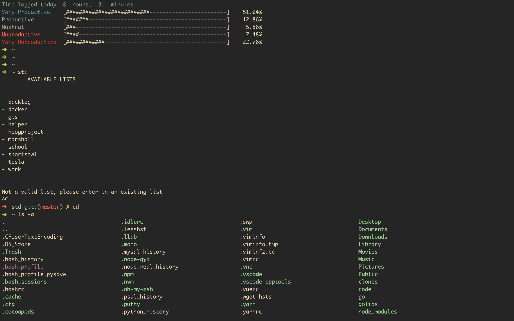

# My humble approach to dotfiles

This is just an approach that I have working pretty well for myself right now for my zsh setup and vim setup.

It is of a humble beginning for right now. But I have my vim setup around go, good file management with nerdtree, as well as some of my own tools
implemented nicely.

## Colorscheme

I got to use gruvbox for both my vim setup and also my .zsh setup... the look is awesome and they really compliment each other well!

## Fonts

I decided to bypass editing the zsh fonts for now. I am just a fan of the simplicity offered by the original work of .oh-my-zsh 

## Misc

If you take a further look at the aliases that I have in my .zshrc, I think the true magic of this setup will come out then. 

# Thanks for stopping by!

